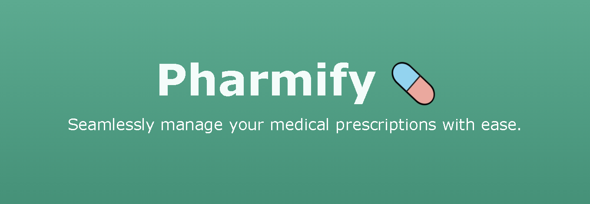

<p align="center">
  

---
## Table of Contents
- [Overview](#Pharmify)
- [Installation](#installation)
- [Usage](#usage)
- [Features](#features)
- [Technologies Used](#technologies-used)
- [Contributing](#contributing)
- [License](#license)

---
## Overview
Pharmify is a web application that enables users to manage and receive notifications for their medical prescriptions. The application also allows users to share their prescriptions with other users on the app serving as their caretakers. The application is built using a Vue frontend, NodeJS API, and a MariaDB database. These components of the application are containerized and deployed with Docker.


## Installation
To run this application locally, make sure you have [Docker](https://docs.docker.com/get-docker/) installed on your machine. Then, follow the steps below:

1. Clone the repository:
```sh
git clone <repo-url>
```

2. Navigate to the project directory:
```sh
cd Pharmify
```

3. The application requires a `.env` file to be present in the root directory of the project. See the `.env.template` file for an example of the required environment variables.
    - The `API_SECRET_KEY` variable is used to sign and verify JSON Web Tokens (JWTs) used for authentication. It should be set to a random string of characters.
    - The `EMAIL_ADDRESS` variable represents the sender for the push notifications sent by the backend. It should be a valid address.
    - The `VAPID_PRIVATE` and `VAPID_PUBLIC` variables are used to configure the Web Push functionality. These keys can be generated at [`vapidkeys.com`](https://vapidkeys.com/) or using the `web-push` CLI tool.

4. The Vue frontend also requires a `.env` file to be present in the `/frontend` directory. See the `/frontend/.env.template` file for an example of the required environment variables.
    - The `VUE_APP_VAPID_PUBLIC_KEY` variable is required in order for the Service Worker to begin receiving push notifications from the backend. This variable should be set to the same value as the `VAPID_PUBLIC` variable in the root `.env` file.

5. Build the Docker containers using Docker Compose:
```sh
docker-compose build
```

6. Start the Docker containers:
```sh
docker-compose up
```

Once the containers are up and running, you can access the application at `http://localhost`.


## Usage
The following steps outline how to use the application:

1. Navigate to the application at `http://localhost` in your web browser.

2. Click `Register` and  create a new account.

3. Once you have created an account, you will be redirected to the login page. Enter your credentials and click `Login`.

4. You will be redirected to the dashboard page. The dashboard page displays your current prescriptions, as well as links to add a new prescription, view prescription history, and manage your caretakers. The navigation bar at the top of the page provides links to the dashboard (home icon), settings (gear icon) to manage push notification permissions, and logout (exit icon).


## Features
The application enables users to manage and track their medical prescriptions, as well as make their prescriptions available to other users on the app serving as their caregivers. The key features of the application include:

- **Prescription Management:** Users can add and view current prescriptions, as well as view their prescription history. The application will prompt users to take their prescriptions when they are due.

- **Prescription Sharing:** Users can assign other users as their caretakers, allowing the caretaker to view and manage their prescriptions.

- **Real-time Alerts:** Users can receive push notifications when their prescriptions are due or when their prescriptions are updated by their caregivers.


## Technologies Used
This project makes use of several technologies to provide a comprehensive solution. The key technologies used in this project include:

**Frontend**
- **Vue.js:** The frontend of the application is developed using Vue.js

- **Service Workers:** Service worker scripts are used to cache application data and requested pages using the built-in Cache API and provide a better user experience even when the application is offline. The service worker also enables push notifications for the application.

**Backend**
- **Node.js:** The Node.js backend is responsible for handling API requests, processing data, scheduling/sending push notifications, and interacting with the database.

- **Web Push API:** The Web Push API is utilized in the Node.js backend to send push notifications to the frontend. It allows the server to push notifications to the service worker registered in the browser, enabling real-time alerts.

**Database**
- **MariaDB:** A popular open-source relational database management system. The MariaDB image is used as the database backend to store and manage application data.

**Deployment**
- **Docker:** Docker is used to containerize the frontend, backend, and database components of the application.

- **Docker Compose:** Docker Compose is used to define and orchestrate the multi-container application setup for ease of deployment.


## License
Distributed under the MIT License. See [`LICENSE.md`](./LICENSE.md) for more information.